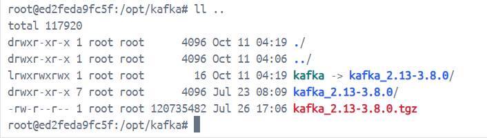
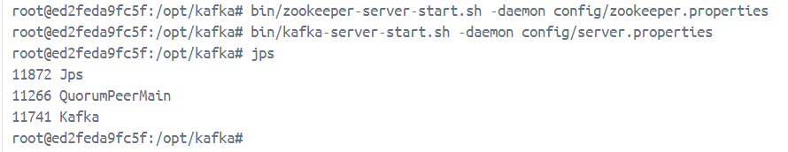
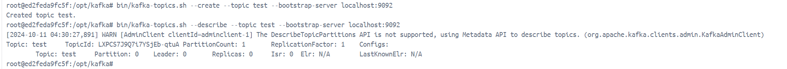
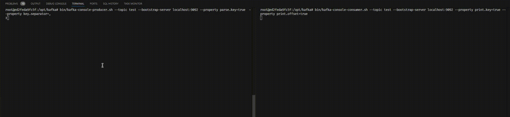

# Запуск Kafka

1. Запустить Ubuntu в Docker container

   ```bash
   docker compose up -d
   ```

2. Подключиться к командной строке контейнера

   ```bash
   docker exec -it ubuntu-kakfa-hw bash
   ```

3. Выполнить установку kafka

   ```bash
   apt update && apt install -y wget openjdk-8-jdk && wget https://downloads.apache.org/kafka/3.8.0/kafka_2.13-3.8.0.tgz -O /opt/kafka_2.13-3.8.0.tgz && cd /opt && tar -xzf kafka_2.13-3.8.0.tgz && ln -s kafka_2.13-3.8.0 kafka && cd kafka
   ```

   В результате выполнения данной команды должна появиться структура следующая файлов:

   
4. Выполнить запуск zookeeper и kafka broker

   ```bash
   bin/zookeeper-server-start.sh --daemon config/zookeeper.properties
   bin/kafka-server-start.sh --daemon config/server.properties
   ```

5. Проверка, что у нас все запустилось

   ```
   jps
   ```

   
6. Создаем топик в Kafka broker

   ```
   bin/kafka-topics.sh --create --topic test --bootstrap-server localhost:9092
   ```

   
7. Подпишемся на топик

   ```
   bin/kafka-console-consumer.sh --bootstrap-server localhost:9092 --property print.key=true --property print.offset=true
   ```

8. Отправим сообщения в топик

   ```
   bin/kafka-console-producer.sh --topic test --bootstrap-server localhost:9092 --property parse.key=true  --property key.separator=,
   ```

9. Прочитаем сообщения из топика

   ```
   bin/kafka-console-consumer.sh --topic test --bootstrap-server localhost:9092 --property print.key=true --property print.offset=true
   ```

