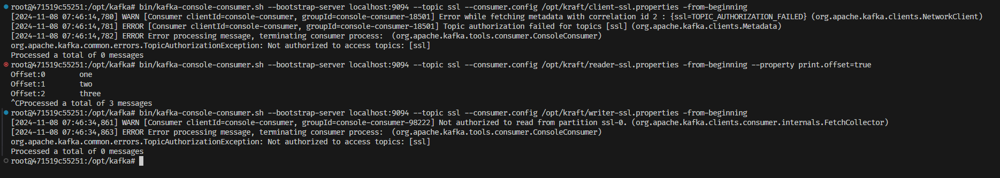

# HomeWork2

## Запуск Kafka

1. Запустить Ubuntu в Docker container

   ```bash
   docker compose up -d
   ```

2. Подключиться к командной строке контейнера

   ```bash
   docker exec -it ubuntu-kakfa-hw bash
   ```

3. Выполнить установку kafka

   ```bash
   apt update && apt install -y wget openjdk-8-jdk && wget https://downloads.apache.org/kafka/3.8.0/kafka_2.13-3.8.0.tgz -O /opt/kafka_2.13-3.8.0.tgz && cd /opt && tar -xzf kafka_2.13-3.8.0.tgz && ln -s kafka_2.13-3.8.0 kafka && cd kafka
   ```

4. Выполнить генерацию UUID и отформатировать папки для журналов

   ```bash
    KAFKA_CLUSTER_ID="$(bin/kafka-storage.sh random-uuid)" && bin/kafka-storage.sh format  --cluster-id $KAFKA_CLUSTER_ID --config ../kraft/server-sasl.properties
    KAFKA_CLUSTER_ID="$(bin/kafka-storage.sh random-uuid)" && bin/kafka-storage.sh format  --cluster-id $KAFKA_CLUSTER_ID --config ../kraft/server-sasl_ssl.properties
   ```

5. Стартуем сервер c SASL/PLAINTEXT

   ```bash
    KAFKA_OPTS="-Djava.security.auth.login.config=/opt/kraft/jaas.conf" bin/kafka-server-start.sh -daemon /opt/kraft/server-sasl.properties
   ```

6. Создаем топик

   ```bash
   bin/kafka-topics.sh --create --topic test --bootstrap-server localhost:9094 --command-config /opt/kraft/client.properties
   ```

7. Вывод команды (без передачи настроек клиента топик не создается)

   

8. Создадим ACL для writer и reader

    ```bash
    bin/kafka-acls.sh --bootstrap-server localhost:9094 --add --allow-principal User:reader --operation Read --topic test --command-config /opt/kraft/client.properties > /dev/null && \
    bin/kafka-acls.sh --bootstrap-server localhost:9094 --add --allow-principal User:writer --operation Write --topic test --command-config /opt/kraft/client.properties > /dev/null && \
    bin/kafka-acls.sh --bootstrap-server localhost:9094 --list --command-config /opt/kraft/client.properties
    ```

    

9. Вывод топиков от каждого пользователя:

    

10. Запись сообщения в топик

    ```bash
    bin/kafka-console-producer.sh --bootstrap-server localhost:9094 --topic test --producer.config /opt/kraft/client.properties
    bin/kafka-console-producer.sh --bootstrap-server localhost:9094 --topic test --producer.config /opt/kraft/reader.properties
    bin/kafka-console-producer.sh --bootstrap-server localhost:9094 --topic test --producer.config /opt/kraft/writer.properties
    ```

    

11. Чтение сообщений из топика

    ```bash
    bin/kafka-console-consumer.sh --bootstrap-server localhost:9094 --topic test --consumer.config /opt/kraft/client.properties -from-beginning
    bin/kafka-console-consumer.sh --bootstrap-server localhost:9094 --topic test --consumer.config /opt/kraft/reader.properties -from-beginning
    bin/kafka-console-consumer.sh --bootstrap-server localhost:9094 --topic test --consumer.config /opt/kraft/writer.properties -from-beginning
    ```

    

## SSL

1. Создадим kestore и truststore для сервера, а затем для root,client,writer,reader

    ```bash
    /opt/kraft/gen-srv.sh
    /opt/kraft/gen-cli.sh
    ```

2. Стартуем сервер c SASL/SSL

   ```bash
    bin/kafka-server-start.sh -daemon /opt/kraft/server-ssl.properties
   ```

3. Добавим ACL
   

4. Запросим топики
    

5. Запись сообщения в топик
   
6. Чтение сообщений из топика
   