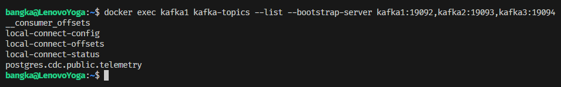

# Homework 6

1. Заупскаем инстанс и проверяем статус Kafka Connect

   ```
   docker-compose up -d
   ```

   

2. Создадим таблицу в PostgreSQL и запишем в неё данные

   
3. Создаём коннектор
   
   


4. Проверяем топики в kafka
   


5. Выполняем Insert|Update|Delete в БД
   
   
